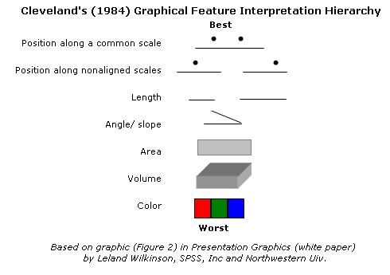

Licensed under the 
[Creative Commons attribution-noncommercial license](http://creativecommons.org/licenses/by-nc/3.0/).
Please share \& remix noncommercially, mentioning its origin.

```{r setup, echo=FALSE,message=FALSE}
library(knitr)
opts_knit$set(fig.align="center",fig.width=7,fig.height=5,
               out.width="0.7\\textwidth",tidy=FALSE,use.highlight=TRUE)
knit_hooks$set(basefig=function(before, options, envir) {
                   if (before) {
                       par(bty="l",las=1)
                   } else { }
               })
``` 

## Basic criteria for data presentation

If you're at all interested in this topic, the talk by @rauser_how_2016 ([here](https://www.youtube.com/watch?v=fSgEeI2Xpdc)) is **strongly** recommended.

Visual perception of quantitative information: [Cleveland hierarchy](http://processtrends.com/toc_data_visualization.htm) [@cleveland_graphical_1984,@cleveland_graphical_1987,@cleveland_visualizing_1993]




## Techniques for multilevel data

* **faceting** (= trellis plots = small multiples) vs **grouping** ("spaghetti plots")
* join data within a group by lines (perhaps thin/transparent)
* colour lines by group (more useful for explanatory than presentation graphics)
* dynamic graphics (hovertext; `plotly::ggplotly`)
* other ways to indicate grouping: `stat_ellipse`, `ggalt::geom_encircle`, `stat_centseg` (from `../R/geom_cstar.R`)
* depends on context: how many groups, what kind of predictors? time series or scatterplots?

`ggplot2` makes it fairly easy to do a simple *two-stage* analysis on the fly using `geom_smooth`, e.g. with the CBPP data discussed below:

## ggplot 

- **G**rammar of **G**raphics: based on @Wilkinson1999
- documented in @wickham_ggplot2_2009, also [web site](http://had.co.nz/ggplot2), [mailing list](http://groups.google.com/group/ggplot2), [StackOverflow tag](https://stackoverflow.com/questions/tagged/ggplot2)
- explicit mapping from variables to "aesthetics": e.g. x, y, colour, size, shape
- easier to overlay multiple data sets, data summaries, model predictions etc.
- rendering can be slow
- `ggalt`, `gridExtra`, `ggExtra`, `cowplot`, `directlabels` packages useful
- [ggplot gallery](http://www.ggplot2-exts.org/gallery/); [ggplot extensions](https://www.ggplot2-exts.org/)

## Rules of thumb

* what goes where? Based on Cleveland hierarchy
     * (Continuous) response on the $y$-axis, most salient (continuous) predictor on the $x$-axis (or many categories)
     * Most salient comparisons within the same subplot (distinguished by color/shape), and nearby within the subplot when grouping bars/points
     * Facet rows > facet columns
* flip axes to display labels better (`coord_flip()`, `ggstance()` package)
* use transparency to include important but potentially distracting detail
* do category levels need to be *identified* or just *distinguished*?
* choose geoms according to data size: points < boxplots < violin, hexbin
* order categorical variables meaningfully ("What's wrong with Alabama?"): `forcats::fct_reorder()`, `forcats::fct_infreq()`
* choose colors carefully (`RColorBrewer`/[ColorBrewer](colorbrewer2.org/), [IWantHue](http://tools.medialab.sciences-po.fr/iwanthue/)): respect dichromats and B&W printouts
* visual design (tweaking) vs. reproducibility (e.g. `ggrepel`, `directlabels` packages)

## ggplot intro

-   **data**
-   **mappings**: between variables in the data frame and **aesthetics**, or graphical attributes
(x position, y position, size, colour ...)
-   first two show up as (e.g.) `ggplot(my_data,aes(x=age,y=rootgrowth,colour=phosphate))`
-   **geoms**:
   - simple: `geom_point`, `geom_line`
```{r ex,fig.keep="none", message=FALSE}
load("../data/gopherdat2.RData")
library("ggplot2"); theme_set(theme_bw())
(ggplot(Gdat,aes(x=year,y=shells/Area,colour=Site))
    + geom_point()
)
```
- more complex: `geom_boxplot`, `geom_smooth`
- geoms are **added** to an existing data/mapping combination
- **facets**: `facet_wrap` (free-form wrapping of subplots), `facet_grid` (two-D grid of subplots)
- also: scales, coordinate transformations, statistical summaries, position adjustments ...

See [Karthik Ram's ggplot intro](https://github.com/karthikram/ggplot-lecture) or [my intro for disease ecologists](http://ms.mcmaster.ca/~bolker/eeid/ecology/ggplot.pdf), among many others.

# Multilevel data examples

```{r pkgs,message=FALSE}
library("ggalt")
source("../R/geom_cstar.R")
```

## time series: cbpp data set

Contagious bovine pleuropneumonia (CBPP): from @lesnoff_within-herd_2004, via the `lme4` package. See `?lme4::cbpp` for details.

```{r ggplot2}
data("cbpp",package="lme4")
## make period *numeric* so lines will be connected/grouping won't happen
cbpp2 <- transform(cbpp,period=as.numeric(as.character(period)))
g0 <- ggplot(cbpp2,aes(period,incidence/size)) ## plot template (no geom)
```

### spaghetti plot

```{r spaghetti,fig.keep="none"}
g1 <- (g0
    +geom_line(aes(colour=herd))
    +geom_point(aes(size=size,colour=herd))
)
```

Do we need the colours?
```{r nocol,fig.keep="none"}
g2 <- (g0
    +geom_line(aes(group=herd))
    +geom_point(aes(size=size,group=herd))
)
```

Facet instead:

```{r facet,fig.keep="none"}
g4 <- g1+facet_wrap(~herd)
```

Order by average prop. incidence, using the `%+%` trick:

```{r order,fig.keep="none",message=FALSE}
cbpp2R <- transform(cbpp2,herd=reorder(herd,incidence/size))
g4 %+% cbpp2R
```

two-stage analysis:

```{r ggplot_mult2,fig.keep="none",warning=FALSE}
(g0
    + geom_point(aes(size=size,group=herd))
    + geom_smooth(aes(group=herd,weight=size),
                  method="glm",
                  method.args=list(family=binomial),
                  se=FALSE))
```
(ignore `glm.fit` warnings if you try this)


## scatterplots: gopher tortoise mycoplasma data

Gopher tortoise data (from @ozgul_upper_2009, see [ecostats chapter](http://bbolker.github.io/mixedmodels-misc/ecostats_chap.html#data))

Plot density of shells from freshly dead tortoises (`shells/Area`) as a function of mycoplasmal prevalence (%, `prev`): you may want to consider site, year of collection, or population density as well.

```{r gopher1,fig.keep="none"}
load("../data/gopherdat2.RData")
g5 <- ggplot(Gdat,aes(prev,shells/Area))+geom_point()
```

```{r gopher2,fig.keep="none"}
g5+geom_encircle(aes(group=Site))
g5+geom_encircle(aes(group=Site),s_shape=1,expand=0) ## convex hulls
## connect points to center
g5+stat_centseg(aes(group=Site),cfun=mean)
```

## treatment comparisons: clipping data

Data from @banta_comprehensive_2010:

Easier if there is one data point per group (connect with lines),
but 

```{r banta1,fig.keep="none"}
load("../data/Banta.RData")
## dat.tf$ltf1 <- log(dat.tf$total.fruits+1)
g6 <- ggplot(dat.tf,aes(nutrient,total.fruits,colour=gen))+
    geom_point()+
    scale_y_continuous(trans="log1p")+
    facet_wrap(~amd)+
    stat_summary(fun.y=mean,aes(group=interaction(popu,gen)),
                 geom="line")
```

If `stat_summary` is used with `fun.data=`, it can also compute confidence intervals.  Try `"mean_cl_boot"` or `"mean_cl_normal"` (see `?mean_cl_boot`)

Dynamic graphics:

```{r plotly_ex,warning=FALSE,eval=FALSE}
library(plotly)
ggplotly(g6)
```

## exercise

Pick a data set from the list available on the web page (or use your own) and create two plots that indicate the grouping in different ways.

```{r sessioninfo,eval=FALSE,echo=FALSE}
sessionInfo()
```

## References
