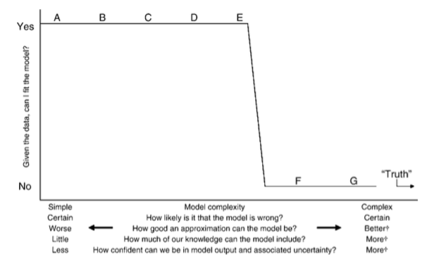

```{r knitr,include=FALSE}
require("knitr")
knitr::opts_knit$set(root.dir = here::here())
```


# overview

## obligatory Tolstoy quote

* "all happy families are alike ..."
* ... but there are certainly *categories* of problems

## categories of warnings

* messages vs warnings vs errors
* convergence (numerical optimization questionable)
* singular fits (model is degenerate)
   * other forms of degeneracy (complete separation etc.)
* model diagnostics issues (model is inappropriate)

## messages vs warnings vs errors

* message = informational
* warning = potentially serious problem. Don't ignore unless you understand it, and if so, then eliminate the warning as far upstream as possible (e.g. by changing options/settings; `suppressWarnings()` if that's the only choice)
* error = so serious that R/package author can't or won't give you an answer (may be possible to override/work around ...)

## load packages

```{r pkgs, message=FALSE, warning = FALSE}
library(tidyverse)
library(broom.mixed)
library(lme4)
library(blme)
library(glmmTMB)
library(Matrix)
```

# convergence problems

## non-positive-definite Hessians

* what does this mean?
* modern mixed-model software does some form of non-linear optimization
    * sometimes just the covariance parameters, sometimes fixed + covariance parameters
	* (random-effects parameters are profiled out or estimated in an internal loop)
* at the optimum we should have a gradient of zero and a **positive definite** Hessian

##  Hessian

\newcommand{\jjdiag}[1]{\frac{\partial^2 L}{\partial \beta_{#1}^2}}
\newcommand{\jjoff}[2]{\frac{\partial^2 L}{\partial \beta_{#1} \partial \beta_{#2}}}

\[
\left(
\begin{array}{cccc}
\jjdiag{1} & \jjoff{1}{2} & \jjoff{1}{3} & \ldots \\
\jjoff{2}{1} & \jjdiag{2} & \jjoff{2}{3} & \ldots \\
\jjoff{3}{1} & \jjoff{3}{2} & \jjdiag{3} & \ldots \\
\vdots & \vdots & \vdots & \ddots
\end{array}
\right)
\]


## 

* eigenvalues of the Hessian give curvature in the principal directions (== eigenvectors)

```{r hesspix,echo = FALSE}
## add picture: curve3d + genrose
cc <- emdbook::curve3d(x^2+y^2+3*x*y, from = c(-1, -1), to = c(1,1),
                       sys3d = "contour", ann = FALSE, axes = FALSE,
                       xlab = "", ylab = "",
                       labels = "", asp = 1)
arrows(-0.25, -0.25, 0.25, 0.25, code = 3)
arrows(-0.25, 0.25, 0.25, -0.25, code = 3)
box()
```

## solutions

* double-check the model definition and data
    * one random effect per observation (when the conditional distribution has a scale parameter)
	* all observations in a cluster have the same response value (e.g. [here](https://stackoverflow.com/a/53053309/190277))
	* etc.
* scale and center predictor variables (improves stability)
* general advice in Bolker *et al.* 2013 [@bolker_strategies_2013] *may* be useful
* extract Hessian and see *which* eigenvector(s) is/are associated with the minimal eigenvalue(s)
   * extracting Hessian often requires some digging, e.g. `model@optinfo$derivs` (`lme4`) or `model$sdr$cov.fixed` (`glmmTMB`))
  
## more examples

* many GLMM parameters have a *bounded domain*
   * variances/standard deviations/dispersion parameters (0 to $\infty$)
   * probabilities (0 to 1)
* the easiest way to handle bounded optimization is to fit a *transformed*, unconstrained version of the parameter
   * log (variance, SD, ratios thereof, odds ratios)
   * logit/log-odds (probabilities)
* problems when the estimate is actually on the boundary of the original domain (transformed parameter $\to \pm \infty$)
* different packages handle this in different ways

## example: negative binomial dispersion

* NBinom can only handle *overdispersion*, not equi- or underdispersion
* example:

```r
set.seed(102)
dd <- data.frame(x = rpois(1000, lambda = 2))
m1 <- MASS::glm.nb(x ~ 1, data = dd)
environment(m1$family$variance)$.Theta
```
* **solutions**
   * ignore it
   * revert to Poisson model
   * use a *quasi-likelihood* model (fit Poisson, then adjust SEs etc.)
   * use a distribution that allows underdispersion: (glmmTMB) `genpois`, `compois`, or an *ordinal* model

## example: non-zero-inflated models

* *zero-inflation* models fit a finite mixture of "structural" and "sampling" zeros
* "many zeros does not mean zero inflation" [@warton_many_2005]
* log-odds(0) $\to -\infty$
* similar to NB case

## `lme4` convergence warnings

## a specific (problematic!) case

* extra check on top of optimizer-based convergence checks
* many false positives

## diagnosing convergence warnings

* `allFit`
* are parameters close enough?
* what is the distribution of negative log-likelihoods?
* which parameters are unstable?

```{r conv1, message = FALSE}
library(lme4)
source("R/conv_ex.R")
model1 <- lmer(eval~1 + group*(emint_n + grade_n) + (1 + grade_n+emint_n|class), data=dd)
```

Scaling (autoscaling is [on the list for lme4](https://github.com/lme4/lme4/issues/731)) ...

```r
double_cols <- sapply(dd, is.double)
dd_sc <- dd
dd_sc[double_cols] <- sapply(dd[double_cols], \(x) drop(scale(x)))
model2 <- update(model1, data =  dd_sc)
```

```{r allfit}
library(broom.mixed) ## for tidy()
library(ggplot2)
source("R/allFit_utils.R")
aa <- allFit(model1)
tt <- tidy(aa)
```

Check log-likelihoods: do most or all optimizers agree?

```{r allfit-nll}
glance_allfit_NLL(aa)
```

Run convergence check by hand:

```{r convcheck}
checkConv(model1@optinfo$derivs, model1@optinfo$val, lmerControl()$checkConv, model1@lower)
```

(in this case it is the *scaled* gradient that fails the test).

Check 

```{r allfit-fixef}
plot_allfit(aa) + theme_set(theme_bw())
```

Check random effect components (may or may not be of interest):

```{r allfit-corsd, fig.width = 12}
plot_allfit(aa, keep_effects = "ran_pars")
```

## singular fits

* best-fit value of a variance can be 0
* e.g. expected among-group variance in a 1-way ANOVA is $\sigma^2_b + (\sigma^2_w)/n$. If we substitute sample
values for these quantities we can get a method-of-moments estimate <0 ...
* [@pryseley_estimating_2011; @bridgeNegative2024]
* `lme4` is a little more graceful than `glmmTMB`; fits

```{r sim-sing, cache=TRUE}
simfun <- function() {
    dd <- expand.grid(f = factor(1:3), rep = 1:10)
    dd$y <- suppressMessages(simulate(~ 1 + (1|f),
                     newdata = dd,
                     newparams = list(beta = 0, theta = 0.1, sigma = 1),
                     family = gaussian))[[1]]
    m <- lmer(y ~ 1 + (1 | f), data = dd,
              control = lmerControl(calc.derivs=FALSE, check.conv.singular = "ignore"))
    getME(m, "theta")
}
simfun()
set.seed(101)
thvec <- replicate(500, simfun())
hist(thvec, breaks = 50)
```

```{r}
library(lme4)
data(Orthodont,package="nlme")
Orthodont$nsex <- as.numeric(Orthodont$Sex=="Male")
Orthodont$nsexage <- with(Orthodont, nsex*age)
m1 <- lmer(distance ~ age + (age|Subject) + (0+nsex|Subject),
           start = c(1.8,-0.1,0.14, 0.5),
           ##(0 + nsexage|Subject),
           data=Orthodont)
VarCorr(m1)
rePCA(m1)
library(nlme)
m2 <- lme(distance ~ age, random = ~age|Subject,
    data = Orthodont,
    weights = varIdent(form = ~1|Sex))
library(glmmTMB)
m3 <- glmmTMB(distance ~ age + (age|Subject),
              dispformula = ~Sex,
              REML = TRUE,
              data = Orthodont)
exp(fixef(m3)$disp)
logLik(m3)
```

## model simplification

* drop terms, e.g. correlation between slopes and intercepts [@barr_random_2013]
* (should probably center continuous covariates first)
* Matuschek *et al* [@matuschek_balancing_2017] say you should be dropping terms anyway
* drop correlations (e.g. `(f||g)` or `diag(f|g)`
* reduced-rank models (`glmmTMB` does *factor analytic* models, e.g. `rr(f1*f2|g, d = 5)`; or `gllvm` package)
* `buildmer` package (??)

## model simplication [@uriartePreaching2009a]

```{r uriarte}

```

## regularization

* `blme`: assign priors, do maximum *a posteriori* estimation
   * default for RE terms: SD $\sim$ Gamma(shape = 2.5, rate = 0) [@chung_nondegenerate_2013]
* priors in `glmmTMB` (new)
* priors in Bayesian pkgs (of course) `MCMCglmm`, `brms`, `rstanarm`

## complete separation (GLM(M)-specific)

* Bernoulli data with 0/1 separation, count data with 0/positive separation
* Firth regression; add priors

## example (from glmmTMB vignette)

```{r complete_sep}
load("data/culcita.RData")
cdatx <- culcita_dat[-20,]
form <- predation~ttt+(1|block)
cmod_glmer <- glmer(form, data=cdatx, family=binomial)
cmod_glmmTMB <- glmmTMB(form, data=cdatx, family=binomial)
cmod_bglmer <- bglmer(form, data=cdatx, family=binomial,
                    fixef.prior = normal(cov = diag(9,4)))
cprior <- data.frame(prior = rep("normal(0,3)", 2),
                     class = rep("beta", 2),
                     coef = c("(Intercept)", ""))
cmod_glmmTMB_p <- update(cmod_glmmTMB, priors = cprior)
tt <- (tibble::lst(cmod_glmer, cmod_glmmTMB, cmod_bglmer, cmod_glmmTMB_p)
    |> purrr::map_dfr(~ tidy(., effects = "fixed"), .id = "model")
)
ggplot(tt, aes(x = estimate, y = term, colour = model)) +
       geom_pointrange(aes(xmin = estimate - 2*std.error,
                           xmax = estimate + 2*std.error),
                       position = position_dodge(width = 0.5))
```
