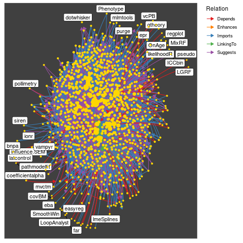
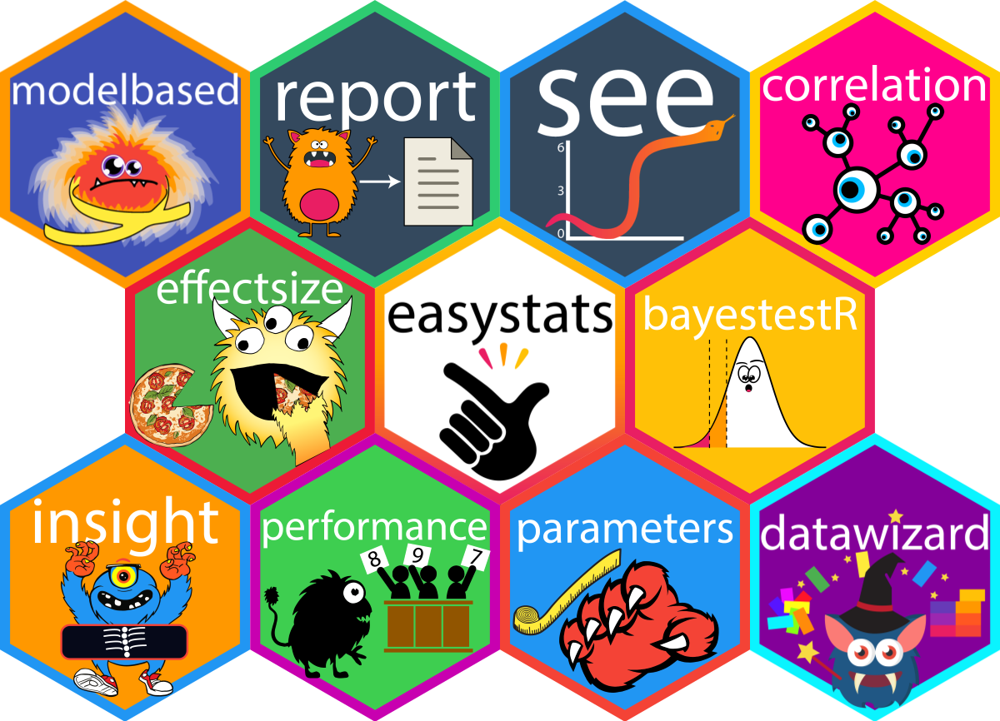
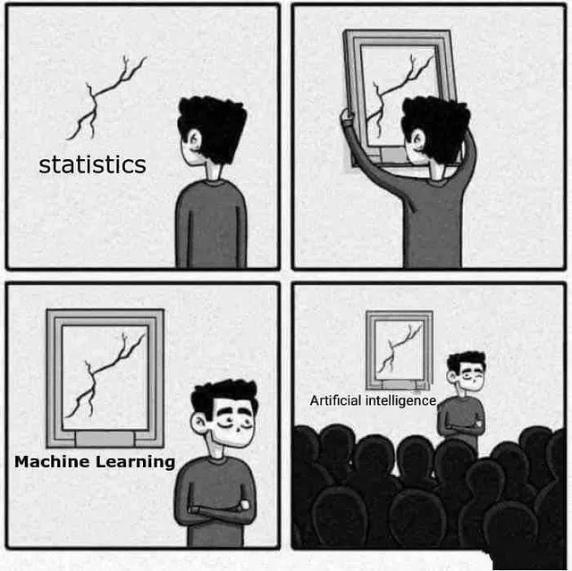
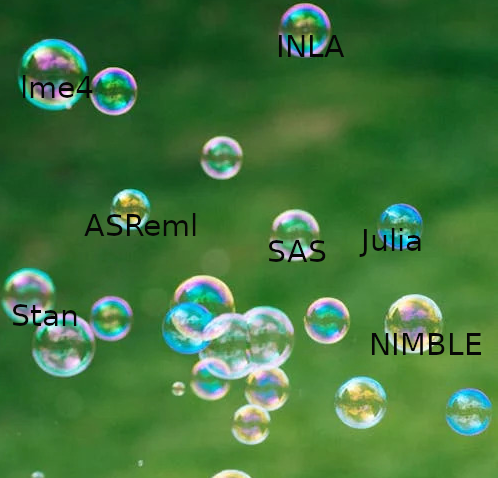

<style>
.refs {
   font-size: 14px;
}
h2 { 
 color: #3399ff;		
}
h3 { 
 color: #3399ff;		
}
.title-slide {
   background-color: #55bbff;
}

.pre {
  height: 30pc;
  overflow-y: scroll;
}

<!-- https://stackoverflow.com/questions/50378349/force-column-break-in-rmarkdown-ioslides-columns-2-layout -->
.forceBreak { -webkit-column-break-after: always; break-after: column; }
</style>

```{r setup, include = FALSE}
knitr::opts_chunk$set(echo = FALSE, dpi = 200, optipng = knitr::hook_optipng)
options(bitmapType = "cairo")
```

```{r pkgs, message = FALSE}
library(knitr)
library(ggplot2); theme_set(theme_bw(base_size=16))
```

# Definitions and scope

## GLMMs: the biggest picture

* what is the scope of this talk?
* linear fixed effects (possibly with a link function)
* linear random effects/*latent variables* (ditto)
* known clusters with independent sets of latent variables
* multivariate Normal Gaussian distribution of latent variables

## in other words

$$
\begin{split}
\underbrace{Y_i}_{\text{response}} & \sim \overbrace{\text{Distr}}^{\substack{\text{conditional} \\ \text{distribution}}}(\underbrace{g^{-1}(\eta_i)}_{\substack{\text{inverse} \\ \text{link} \\ \text{function}}},\underbrace{\phi}_{\substack{\text{scale} \\ \text{parameter}}}) \\
\underbrace{\boldsymbol \eta}_{\substack{\text{linear} \\ \text{predictor}}} & 
 = 
\underbrace{\X \bbeta}_{\substack{\text{fixed} \\ \text{effects}}} + 
\underbrace{\Z \bb}_{\substack{\text{random} \\ \text{effects}}}
\\
\underbrace{\bb}_{\substack{\text{conditional} \\ \text{modes}}}  & 
\sim \text{MVN}(\boldsymbol 0, \underbrace{\Sigma(\boldsymbol \theta)}_{\substack{\text{covariance} \\ \text{matrix}}})
\end{split}
$$


... possibly allow **zero-inflation**/hurdle component, **dispersion** (scale) model (e.g. $\phi = \exp(\X_d \beta_d (? + \Z_d \bb_d ?))$)

# Past

## What is a routine statistical analysis?

depends on:

* data size
* computation time/cost, memory requirements
* availability of reliable software
* complexity of the statistical model
* ANOVA → linear models → GLMs → mixed models → ???

## Commoditization

* "goods ... that are distinguishable in terms of attributes (uniqueness or brand) end up becoming simple commodities in the eyes of the market or consumers" ([Wikipedia](https://en.wikipedia.org/wiki/Commoditization))
* basic components become part of a **stack**/utilities for higher-level features
* operating system → linear algebra packages (BLAS, LAPACK) → regression tools → generalized linear models → mixed models → ... ?
* build on top of well-tested frameworks

## Democratization

* as long as people are educated *enough*
* ¿can we afford enough statistical consultants?
* Efron: "recommending that scientists use [X] is like giving the neighborhood kids the key to your F-16" [@gelmanObjections2008]  
(*X = "Bayes' Theorem" here but could be "mixed models"?*)
* make easy things easy and hard things possible  
(and warn about inadvisable things?)
* importance of sensible defaults

## Domain-specific languages

*  *limited* set of requirements
* R ("a free software environment"): also SAS ... 
* *Wilkinson-Rogers-Bates* formulas [@WilkinsonRogers1973]
    * initial target: designed experiments
	* `GENOTYPE*POL(SITE, 1,SITEMEAN)*POLND(DENSITY)`
	* GENSTAT, expanded in S/R [@chambersStatistical1992a]
	* expanded further to include random effects [@pinheiro_mixed-effects_2000; @tanakaSymbolic2019]
    * further expansions ... (`brms` package etc.)
* **too** compact [@mcelreath_statistical_2015]?  
who really knows what `y ~ x1*x2 + (x1*x2|g)` means?
	
# Present

## Ever-expanding possibilities

```{r get_pkgs, echo=FALSE, cache=TRUE}
pkgs <- ctv:::.get_pkgs_from_ctv_or_repos("MixedModels")
```

* [Mixed models task view](https://cran.r-project.org/web/views/MixedModels.html): currently mentions 169 packages ...

```{r nbr_graph, out.height=400, out.width = 400, fig.align = "center"}

```

## Development and maintenance

Open source software is:

* powerful
* equitable
* reproducible
* transparent
* cutting-edge
* cheap!

## Development and maintenance

<!-- https://bookdown.org/yihui/rmarkdown-cookbook/multi-column.html -->

:::: {style="display: grid; grid-template-columns: 1fr 1fr; grid-column-gap: 50px;"}

::: {}

**BUT**:

* academics are paid to publish Cool Stuff
* researchers are paid to Get Stuff Done
* computational statisticians are rare
* mixed models are a niche market:  
`lme4` is approximately #92 (out of 21K packages) on CRAN

:::

::: {}

```{r dep, out.width=300, out.height=300}
knitr::include_graphics("pix/dependency_2x.png")
```

:::

::::

## Development models

:::: {style="display: grid; grid-template-columns: 1fr 1fr; grid-column-gap: 50px;"}

::: {}

* "the cathedral and the bazaar"
* R (core): cathedral(ish)
* R package ecosystem: bazaar-ish

:::

::: {}

```{r devel, out.width=400, out.height=400}

```

:::

::::

## Consolidation

:::: {style="display: grid; grid-template-columns: 1fr 1fr; grid-column-gap: 50px;"}

::: {}

Partial solution to the Babel of the R ecosystem: multi-use front- and back-ends for workflows

* workflows: `tidymodels`/`mixedmodels`/`easystats`
* diagnostics: `DHARMa`, `performance::check_model()`
* coefficient information: `broom.mixed`, `parameters`
* model information: `broom.mixed`
* predictions: `marginaleffects`, `emmeans`

:::

::: {}

```{r devel-consolidate, out.width=300, out.height=300}

```

:::

::::

# Future

## Machine learning/AI

```{r ML, out.width=400}

```

from [sandserifcomics](https://www.instagram.com/sandserifcomics/)

## machine/statistical learning

* emphasis on algorithms and scalability
* elevate prediction over inference [@breimanStatistical2001]
* (modern) nonparametric models
* automatic differentiation

## new software stacks

* METIS/SuiteSparse/CHOLMOD  
(Davis, Karypis: used in `lme4`, `TMB`)
* INLA meshes (Lindgren, Rue: `INLA`, `sdmTMB`)
* spline basis construction (Wood/`mgcv`)
* autodifferentiation

## autodiff everywhere

* magic algorithm: automatic gradients with cost <5$\times$ cost of objective function [@griewankIntroduction2003]
* CppAD, TMB (Kristensen), Stan (Carpenter/Betancourt), PyTorch, Tensorflow (`greta`), NIMBLE (de Valpine) [@valpineProgramming2017]
* memory-intensive

## prediction vs inference

* any 'parameter' of a model is an expectation of a change in the response
   * partial dependence (*marginal effects*), conditional dependence: 
* users are almost always interested in *counterfactuals*
* ... and estimates of uncertainty (or they should be)
* uncertainty in a counterfactual effect == inference ???
* connections to **causal inference**

## smooths everywhere

* Revisit this layer: $\bb \sim \text{MVN}(\boldsymbol 0, \Sigma(\boldsymbol \theta))$
* if $\Sigma$ is diagonal then this is equivalent to putting a *ridge penalty* ($\bb \bb^\top = \sum b_i^2$) on the conditional modes
* we could use structured covariance matrices (compound symmetry, AR1, etc.)
* ... penalizing by $\bb \Sigma \bb^T$ is equivalent to using a **smoothing matrix** $\Sigma^{-1}$
* Gaussian processes, splines, Markov random fields ...
* `mgcv` package provides implementations that can be used anywhere [@wood_generalized_2017]
    * `gamm4`, `glmmTMB`, `sdmTMB`, `brms` ...

## Scalability

* dimensions of a mixed model
   * number of observations ($10^2$ - $10^8$)
   * number of latent variables ($10$ - $10^4$)
   * number of clusters ($10$ - $10^4$)
   * number of top-level parameters ($\beta$, $\theta$): $10$ - $1000$
* MLE scaling typically ${\cal O}(N^{3/2})$; method-of-moments ${\cal O}(N)$  
(stochastic gradient descent???)
*  Recent work on scalable MM [@heilingEfficient2024; @heilingglmmPen2024; @gaoEfficient2017; @gaoEstimation2020a; @ghoshScalable2022; @ghoshBackfitting2022; @ghandwaniScalable2023]

## Algorithms

* linear algebra (decompositions) [@bates_fitting_2015]
* EM algorithm
* brute-force (RE)ML with autodiff [@brooks_modeling_2017]
* MCEM
* ??

## Sparsity

* computational trick or statement about the world?
* combining mixed models with sparsity-inducing penalization (e.g. `glmmLasso`)
* INLA meshes leverage *conditional independence* of spatial points to handle spatial problems efficiently (`sdmTMB`)

## Dimension reduction

* `mgcv` smooths use *rank reduction* techniques instead of relying on sparsity
* factor-analytic models: `glmmTMB`, `gllvm`

## Sliding toward Bayes

* regularization/priors
   * Bayes: justified by *belief*
   * frequentism: justified by 
       * decreased bias (e.g. Firth logistic regression)
	   * decreased error ([Stein's paradox](https://en.wikipedia.org/wiki/Stein%27s_example), ridge regression)
* empirical Bayes: regularization/priors only on intermediate layers
* maximum *a posteriori* (MAP) estimation: INLA, `blme`
* for good confidence intervals, MCMC is faster than parametric bootstrapping (e.g. pharmacokinetic models)

## Why aren't we all Bayesian?

* concern about subjectivity, ease of use [@efronWhy1986]
* Bayes is still slower

```{r timings, fig.width=3.5, fig.height = 2}
theme_set(theme_bw(base_size=12))
dd <- readRDS("timecomp.rds") |> dplyr::arrange(desc(time)) |>
    dplyr::mutate(package = factor(pkg, levels = unique(pkg)))
ggplot(dd, aes(x = time, y = package)) + geom_boxplot(fill = "gray") + 
  scale_x_log10() + labs(x="time (sec)", y = "")
```

## Looking ahead

:::: {style="display: grid; grid-template-columns: 1fr 1fr; grid-column-gap: 50px;"}

::: {}


* further integration of advanced/scalable techniques into mainstream packages
* improved modularity of estimation engines
* improved workflow support
* community support?

:::

::: {}

```{r bubbles, out.width=300, out.height=300}

```

:::

::::


## references {.refs .columns-2 .pre}

